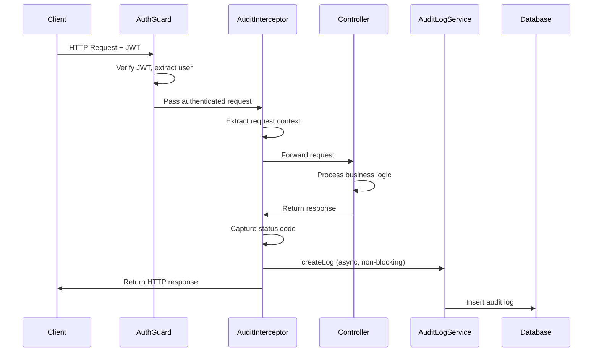
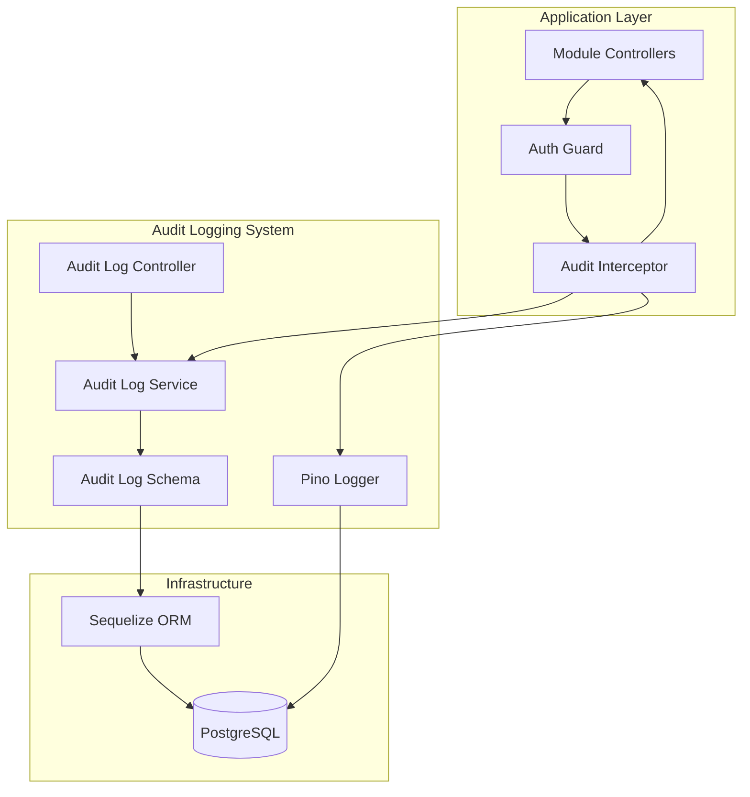

# Design Document: Comprehensive Audit Logging

## Overview

The comprehensive audit logging system enhances the existing audit-logs module to automatically track all authenticated user actions across the NestJS application. The system uses structured logging with Pino for application-level logs and Sequelize ORM for persistent audit trail storage in PostgreSQL.

### Key Design Goals

1. **Zero-Touch Integration**: Automatically capture audit logs without modifying controller code
2. **Performance**: Non-blocking, asynchronous logging that doesn't impact API response times
3. **Comprehensive Context**: Capture user identity, action type, entity information, IP address, user agent, and timing
4. **Graceful Degradation**: Audit logging failures should never disrupt normal application flow
5. **Queryability**: Support rich filtering, searching, and pagination for audit log retrieval
6. **Security**: Accurate IP extraction behind proxies, sensitive data exclusion

### High-Level Architecture

The system consists of five primary components:

1. **Pino Logger**: Structured JSON logging library for application-level logs
2. **Audit Log Schema**: Sequelize model defining database structure with comprehensive fields and indexes
3. **Audit Log Service**: Business logic for creating and querying audit logs
4. **Audit Interceptor**: Global NestJS interceptor that automatically captures all authenticated requests
5. **Audit Log Controller**: REST API endpoints for retrieving and filtering audit logs

### Request Flow



## Architecture

### Component Diagram



### Technology Stack

- **NestJS**: Application framework providing interceptors, guards, and dependency injection
- **Pino**: High-performance JSON logger with low overhead
- **pino-pretty**: Human-readable formatting for development environments
- **Sequelize + sequelize-typescript**: ORM for database operations with TypeScript support
- **PostgreSQL**: Relational database with JSONB support for flexible metadata storage

### Design Patterns

1. **Interceptor Pattern**: Global interceptor captures all requests without controller modifications
2. **Service Layer Pattern**: Business logic encapsulated in AuditLogService
3. **Repository Pattern**: Sequelize models abstract database operations
4. **Dependency Injection**: NestJS DI manages component lifecycle and dependencies
5. **Asynchronous Processing**: Fire-and-forget audit logging to avoid blocking requests

## Components and Interfaces

### 1. Pino Logger Configuration

**Location**: `src/infrastructure/logging/logger.module.ts`, `src/infrastructure/logging/logger.service.ts`

**Responsibilities**:
- Configure Pino with environment-specific settings
- Provide structured logging with correlation IDs
- Enable pretty printing in development
- Output raw JSON in production

**Key Configuration**:
```typescript
{
  level: process.env.LOG_LEVEL || 'info',
  transport: NODE_ENV === 'development' ? {
    target: 'pino-pretty',
    options: {
      colorize: true,
      translateTime: 'SYS:standard',
      ignore: 'pid,hostname'
    }
  } : undefined,
  formatters: {
    level: (label) => ({ level: label })
  }
}
```

### 2. Audit Log Schema

**Location**: `src/modules/audit-logs/schemas/audit-log.schema.ts`

**Responsibilities**:
- Define database structure for audit logs
- Configure indexes for query performance
- Define relationships with User entity
- Support JSONB for flexible metadata

**Key Fields**:
- `id` (UUID): Primary key
- `userId` (UUID): Foreign key to users table
- `module` (string): Module name (bills, transactions, etc.)
- `action` (enum): Action type (CREATE, UPDATE, DELETE, LOGIN, etc.)
- `entityId` (UUID, nullable): ID of the affected resource
- `entityType` (string, nullable): Type of affected resource
- `ipAddress` (string): Client IP address
- `userAgent` (string): Browser/client information
- `requestMethod` (string): HTTP method
- `requestUrl` (string): API endpoint path
- `statusCode` (integer): HTTP response status
- `changes` (JSONB, nullable): Before/after values for updates
- `metadata` (JSONB, nullable): Additional context
- `createdAt` (timestamp): Log creation time

**Indexes**:
- Single-column: userId, module, action, entityId, createdAt
- Composite: (userId, module, createdAt)

### 3. Audit Log Service

**Location**: `src/modules/audit-logs/services/audit-log.service.ts`

**Responsibilities**:
- Create audit log entries
- Query audit logs with filtering and pagination
- Transform query results into API responses
- Handle database errors gracefully

**Key Methods**:

```typescript
interface AuditLogService {
  createLog(data: CreateAuditLogDto): Promise<AuditLog>;
  findAll(filters: AuditLogFilterDto): Promise<QueryResult<AuditLog>>;
  findByUser(userId: string, filters: AuditLogFilterDto): Promise<QueryResult<AuditLog>>;
  findByEntity(entityType: string, entityId: string): Promise<AuditLog[]>;
}
```

**Filter Support**:
- userId, module, action, entityType, entityId
- Date range (dateFrom, dateTo)
- IP address search
- Sorting (createdAt, action, module)
- Pagination (page, limit)

### 4. Audit Interceptor

**Location**: `src/common/interceptors/audit.interceptor.ts`

**Responsibilities**:
- Intercept all authenticated requests
- Extract request context (user, IP, user agent, method, URL)
- Determine action type from HTTP method and URL patterns
- Extract entity information from URL parameters
- Capture response status code
- Asynchronously create audit log without blocking response
- Handle errors gracefully

**Exclusions**:
- Health check endpoints
- Audit log endpoints (to prevent recursion)
- Public endpoints (@Public decorator)
- Unauthenticated requests

**Action Type Mapping**:
- POST → CREATE
- PATCH/PUT → UPDATE
- DELETE → DELETE
- GET → VIEW
- URL pattern overrides:
  - `/auth/login` → LOGIN
  - `/auth/logout` → LOGOUT
  - `/auth/register`, `/auth/signup` → REGISTER
  - `/forgot-password`, `/reset-password` → PASSWORD_RESET
  - `/download` → DOWNLOAD
  - `/export` → EXPORT
  - `/payment`, `/pay` → PAYMENT
  - `/contribution` → CONTRIBUTION
  - `/mark-read`, `/mark-as-read` → MARK_READ

**Entity Type Extraction**:
URL pattern → Entity type mapping:
- `/bills/:id` → Bill
- `/transactions/:id` → Transaction
- `/users/:id` → User
- `/budgets/:id` → Budget
- `/documents/:id` → Document
- `/notifications/:id` → Notification
- `/saving-goals/:id` → SavingGoal
- `/wallets/:id` → Wallet
- `/categories/:id` → Category

**IP Extraction Logic**:
1. Check X-Forwarded-For header (use leftmost IP if multiple)
2. Fallback to X-Real-IP header
3. Fallback to socket remote address

### 5. Audit Log Controller

**Location**: `src/modules/audit-logs/controllers/audit-log.controller.ts`

**Responsibilities**:
- Expose REST API for audit log retrieval
- Validate query parameters using DTOs
- Enforce authorization (admins see all logs, users see only their own)
- Format responses using ApiResponse helper
- Provide Swagger/OpenAPI documentation

**Endpoints**:

```
GET /api/v1/audit-logs
  Query Parameters:
    - page: number (default: 1)
    - limit: number (default: 50)
    - userId: UUID
    - module: string
    - action: ActionType
    - entityType: string
    - entityId: UUID
    - dateFrom: ISO date string
    - dateTo: ISO date string
    - search: string (searches IP address)
    - sortBy: createdAt | action | module
    - sortOrder: asc | desc
  
  Authorization:
    - Admin users: view all logs
    - Regular users: view only own logs (userId filter enforced)
  
  Response:
    {
      success: true,
      message: "Audit logs retrieved successfully",
      data: {
        items: AuditLog[],
        pagination: {
          total: number,
          page: number,
          limit: number,
          totalPages: number
        }
      }
    }
```

### 6. DTOs and Interfaces

**CreateAuditLogDto**:
```typescript
{
  userId: string (UUID, required)
  module: string (required)
  action: ActionType (required)
  entityId?: string (UUID, optional)
  entityType?: string (optional)
  ipAddress: string (required)
  userAgent: string (required)
  requestMethod: string (required)
  requestUrl: string (required)
  statusCode: number (required)
  changes?: Record<string, any> (optional)
  metadata?: Record<string, any> (optional)
}
```

**AuditLogFilterDto**:
```typescript
{
  page?: number (default: 1)
  limit?: number (default: 50)
  userId?: string (UUID)
  module?: string
  action?: ActionType
  entityType?: string
  entityId?: string (UUID)
  dateFrom?: string (ISO date)
  dateTo?: string (ISO date)
  search?: string
  sortBy?: 'createdAt' | 'action' | 'module'
  sortOrder?: 'asc' | 'desc'
}
```

**ActionType Enum**:
```typescript
enum ActionType {
  CREATE = 'CREATE',
  UPDATE = 'UPDATE',
  DELETE = 'DELETE',
  VIEW = 'VIEW',
  LOGIN = 'LOGIN',
  LOGOUT = 'LOGOUT',
  REGISTER = 'REGISTER',
  PASSWORD_RESET = 'PASSWORD_RESET',
  DOWNLOAD = 'DOWNLOAD',
  EXPORT = 'EXPORT',
  PAYMENT = 'PAYMENT',
  CONTRIBUTION = 'CONTRIBUTION',
  MARK_READ = 'MARK_READ'
}
```

### 7. Helper Utilities

**IP Extractor**:
```typescript
function extractIpAddress(request: Request): string {
  const xForwardedFor = request.headers['x-forwarded-for'];
  if (xForwardedFor) {
    const ips = Array.isArray(xForwardedFor) 
      ? xForwardedFor[0] 
      : xForwardedFor;
    return ips.split(',')[0].trim();
  }
  
  const xRealIp = request.headers['x-real-ip'];
  if (xRealIp) {
    return Array.isArray(xRealIp) ? xRealIp[0] : xRealIp;
  }
  
  return request.socket.remoteAddress || 'unknown';
}
```

**Module Name Extractor**:
```typescript
function extractModuleName(url: string): string {
  // Extract from URL pattern: /api/v1/{module}/...
  const match = url.match(/^\/api\/v\d+\/([^/]+)/);
  return match ? match[1] : 'unknown';
}
```

**Entity Information Extractor**:
```typescript
function extractEntityInfo(url: string): { entityType: string | null; entityId: string | null } {
  const entityTypeMap = {
    bills: 'Bill',
    transactions: 'Transaction',
    users: 'User',
    budgets: 'Budget',
    documents: 'Document',
    notifications: 'Notification',
    'saving-goals': 'SavingGoal',
    wallets: 'Wallet',
    categories: 'Category'
  };
  
  const uuidRegex = /[0-9a-f]{8}-[0-9a-f]{4}-[0-9a-f]{4}-[0-9a-f]{4}-[0-9a-f]{12}/i;
  const match = url.match(/\/api\/v\d+\/([^/]+)\/([^/?]+)/);
  
  if (match) {
    const module = match[1];
    const possibleId = match[2];
    
    if (uuidRegex.test(possibleId)) {
      return {
        entityType: entityTypeMap[module] || null,
        entityId: possibleId
      };
    }
  }
  
  return { entityType: null, entityId: null };
}
```

## Data Models

### Audit Log Entity

```typescript
@Table({
  tableName: 'audit_logs',
  paranoid: false, // Hard deletes only - audit logs are immutable
  timestamps: true,
  underscored: false,
  indexes: [
    { fields: ['userId'] },
    { fields: ['module'] },
    { fields: ['action'] },
    { fields: ['entityId'] },
    { fields: ['createdAt'] },
    { fields: ['userId', 'module', 'createdAt'] }
  ]
})
export class AuditLog extends Model {
  @Column({
    type: DataType.UUID,
    defaultValue: DataType.UUIDV4,
    primaryKey: true
  })
  declare id: string;

  @ForeignKey(() => User)
  @Column({ type: DataType.UUID, allowNull: false })
  declare userId: string;

  @BelongsTo(() => User)
  declare user: User;

  @Column({ type: DataType.STRING(50), allowNull: false })
  declare module: string;

  @Column({
    type: DataType.ENUM(...Object.values(ActionType)),
    allowNull: false
  })
  declare action: ActionType;

  @Column({ type: DataType.UUID, allowNull: true })
  declare entityId: string | null;

  @Column({ type: DataType.STRING(50), allowNull: true })
  declare entityType: string | null;

  @Column({ type: DataType.STRING(45), allowNull: false })
  declare ipAddress: string;

  @Column({ type: DataType.STRING(500), allowNull: false })
  declare userAgent: string;

  @Column({ type: DataType.STRING(10), allowNull: false })
  declare requestMethod: string;

  @Column({ type: DataType.STRING(500), allowNull: false })
  declare requestUrl: string;

  @Column({ type: DataType.INTEGER, allowNull: false })
  declare statusCode: number;

  @Column({ type: DataType.JSONB, allowNull: true })
  declare changes: Record<string, any> | null;

  @Column({ type: DataType.JSONB, allowNull: true })
  declare metadata: Record<string, any> | null;

  @CreatedAt
  declare createdAt: Date;

  @UpdatedAt
  declare updatedAt: Date;
}
```

### Database Migration

**Location**: `src/migrations/YYYYMMDDHHMMSS-create-audit-logs-table.js`

The migration will:
1. Create `audit_logs` table with all required columns
2. Add foreign key constraint to `users` table
3. Create performance indexes
4. Support up/down migrations for rollback capability

### Relationships

- `AuditLog` → `User` (many-to-one): Each audit log belongs to one user
- No cascade deletes: Audit logs are preserved even if user is deleted

## Correctness Properties


*A property is a characteristic or behavior that should hold true across all valid executions of a system—essentially, a formal statement about what the system should do. Properties serve as the bridge between human-readable specifications and machine-verifiable correctness guarantees.*

### Property 1: Audit Log Creation Round-Trip

*For any* valid audit log data containing required fields (userId, module, action, requestMethod, requestUrl, statusCode), creating an audit log and then retrieving it by ID should return an equivalent audit log with all field values preserved.

**Validates: Requirements 4.1, 4.3**

### Property 2: Required Field Validation

*For any* audit log data missing one or more required fields (userId, module, action, requestMethod, requestUrl, statusCode), the createLog method should reject the data with a validation error.

**Validates: Requirements 4.2**

### Property 3: Query Filtering Correctness

*For any* combination of valid filter parameters (userId, module, action, entityType, entityId, dateFrom, dateTo, ipAddress), all returned audit logs should match the specified filters, and all audit logs in the database matching those filters should be included in the paginated results.

**Validates: Requirements 4.4, 4.5, 4.6, 5.1, 5.2, 5.3, 5.4, 5.5, 5.6, 5.7, 16.4**

### Property 4: User-Specific Query Isolation

*For any* regular user and any filter parameters, querying audit logs should return only logs where the userId matches the authenticated user's ID, never logs belonging to other users.

**Validates: Requirements 6.5, 15.4**

### Property 5: Admin Full Access

*For any* admin user and any filter parameters, querying audit logs should return all logs matching the filters regardless of which user they belong to.

**Validates: Requirements 6.4**

### Property 6: Request Data Extraction Accuracy

*For any* authenticated HTTP request with headers and URL, the audit interceptor should correctly extract and store: userId from JWT, module from URL path, IP address from headers (respecting X-Forwarded-For priority), user agent from headers, HTTP method, and request URL.

**Validates: Requirements 7.2, 7.3, 7.4, 7.5, 7.6, 7.7, 9.1, 9.2, 9.3, 9.4, 9.5, 9.6, 9.7, 9.8**

### Property 7: IP Address Extraction Priority

*For any* HTTP request, when X-Forwarded-For header is present, it should be used as the IP address source; when absent but X-Real-IP is present, X-Real-IP should be used; when neither is present, socket remote address should be used.

**Validates: Requirements 9.1, 9.2, 9.3, 9.4**

### Property 8: Authenticated Requests Create Audit Logs

*For any* authenticated HTTP request (excluding health checks and audit-log endpoints), an audit log should be created after the request completes.

**Validates: Requirements 7.1, 7.8**

### Property 9: Excluded Endpoints Skip Logging

*For any* request to health check endpoints or audit-log endpoints, no audit log should be created.

**Validates: Requirements 7.10, 7.11**

### Property 10: Unauthenticated Requests Skip Logging

*For any* unauthenticated HTTP request or request to a @Public endpoint, no audit log should be created.

**Validates: Requirements 15.4, 15.5**

### Property 11: Authentication Requirement

*For any* request to the audit logs API endpoint without a valid authentication token, the response should be HTTP 401 Unauthorized.

**Validates: Requirements 6.2**

### Property 12: Error Handling Graceful Degradation

*For any* error occurring during audit log creation (database failure, validation error, etc.), the original HTTP request should complete successfully with its normal response, and the error should be logged.

**Validates: Requirements 12.1, 12.2, 12.3, 12.4, 12.5, 12.6, 12.7**

### Property 13: Async Non-Blocking Logging

*For any* HTTP request with audit logging enabled, the response time should not be significantly increased by audit log creation (audit logging should execute asynchronously after response is sent).

**Validates: Requirements 7.9, 13.1, 13.3**

### Property 14: Pagination Consistency

*For any* query with pagination parameters, the sum of items across all pages should equal the total count, and each item should appear exactly once across all pages.

**Validates: Requirements 5.10, 5.11, 13.6, 13.7, 16.7**

### Property 15: Metadata Excludes Sensitive Data

*For any* audit log entry with metadata, the metadata field should not contain passwords, access tokens, refresh tokens, or other sensitive authentication credentials.

**Validates: Requirements 18.5**

### Property 16: Structured JSON Logging

*For any* log message generated by Pino logger, the output should be valid JSON that can be parsed without errors.

**Validates: Requirements 1.2**

### Property 17: Correlation ID Presence

*For any* log entry generated within a request context, the log should include a Request_Correlation_ID field for tracing.

**Validates: Requirements 1.6, 18.1**

### Property 18: Changes Tracking for Updates

*For any* UPDATE action that is logged (where Changes_Tracker is implemented), the audit log should contain a changes field with before and after states of the modified entity.

**Validates: Requirements 11.1, 11.2, 11.3, 11.4**

## Error Handling

### Audit Logging Errors

**Principle**: Audit logging is a supporting concern and should never disrupt normal application flow.

**Implementation Strategy**:

1. **Try-Catch Wrapper**: All audit interceptor logic wrapped in try-catch blocks
2. **Async Fire-and-Forget**: createLog called without await, errors caught internally
3. **Error Logging**: Audit failures logged to Pino with error level and request context
4. **Silent Failures**: No audit errors propagated to client
5. **Database Resilience**: Connection pool handles transient failures

**Error Scenarios**:

| Error Type | Handling Strategy |
|------------|-------------------|
| Database connection failure | Log error, allow request to proceed |
| Validation error in audit data | Log error with details, allow request to proceed |
| Missing required fields | Log error, allow request to proceed |
| JSONB serialization failure | Log error, set field to null, continue |
| Sequelize query timeout | Log error, allow request to proceed |
| Foreign key constraint violation | Log error (user may be deleted), allow request to proceed |

**Error Logging Format**:
```typescript
{
  level: 'error',
  message: 'Failed to create audit log',
  error: {
    name: 'DatabaseError',
    message: 'Connection timeout',
    stack: '...'
  },
  context: {
    userId: 'uuid',
    requestUrl: '/api/v1/bills/123',
    requestMethod: 'POST',
    timestamp: '2024-01-15T10:30:00Z'
  }
}
```

### API Errors

**Controller Error Responses**:

1. **401 Unauthorized**: Missing or invalid authentication token
2. **400 Bad Request**: Invalid query parameters (malformed UUID, invalid date format)
3. **403 Forbidden**: Regular user attempting to access another user's logs
4. **500 Internal Server Error**: Unexpected database or service errors

**Error Response Format**:
```typescript
{
  success: false,
  message: "Error description",
  errors: [
    {
      field: "dateFrom",
      message: "Invalid date format"
    }
  ]
}
```

### Validation Errors

**DTO Validation**: Use class-validator decorators to validate:
- UUID format for userId, entityId
- Enum values for action, sortBy, sortOrder
- Positive integers for page, limit
- ISO date strings for dateFrom, dateTo

## Testing Strategy

The audit logging system requires comprehensive testing to ensure correctness, reliability, and performance. We will use a dual testing approach combining traditional unit tests with property-based tests.

### Testing Approach

**Unit Tests**: Verify specific examples, edge cases, integration points, and error conditions
**Property Tests**: Verify universal properties across randomized inputs to catch corner cases

### Property-Based Testing Configuration

- **Library**: fast-check (for TypeScript/JavaScript)
- **Iterations**: Minimum 100 runs per property test
- **Tagging**: Each property test references its design document property
- **Tag Format**: `Feature: comprehensive-audit-logging, Property {number}: {property_text}`

### Test Categories

#### 1. Schema and Model Tests (Unit Tests)

**File**: `audit-log.schema.spec.ts`

- Verify schema defines all required fields
- Verify correct data types for each field
- Verify indexes are configured
- Verify paranoid mode is disabled
- Verify foreign key relationship to User
- Example: Create audit log instance and validate field types

#### 2. Service Tests (Property + Unit Tests)

**File**: `audit-log.service.spec.ts`

**Property Tests**:
- **Property 1**: Audit log creation round-trip (100 iterations)
  - Generate random valid audit log data
  - Create log, retrieve by ID, verify equivalence
- **Property 2**: Required field validation (100 iterations)
  - Generate audit log data with randomly missing required fields
  - Verify createLog rejects invalid data
- **Property 3**: Query filtering correctness (100 iterations)
  - Generate random audit logs and random filter combinations
  - Verify all results match filters
- **Property 14**: Pagination consistency (100 iterations)
  - Generate random audit logs, query with pagination
  - Verify item count and uniqueness across pages

**Unit Tests**:
- findByUser returns correct user's logs
- findByEntity returns logs for specific entity
- Default pagination values (page 1, limit 50)
- Date range filtering edge cases (same day, null dates)

#### 3. Interceptor Tests (Property + Unit Tests)

**File**: `audit.interceptor.spec.ts`

**Property Tests**:
- **Property 6**: Request data extraction accuracy (100 iterations)
  - Generate random HTTP requests with various headers
  - Verify all extracted data matches request
- **Property 7**: IP address extraction priority (100 iterations)
  - Generate requests with various IP header combinations
  - Verify correct priority order is followed
- **Property 8**: Authenticated requests create logs (100 iterations)
  - Generate random authenticated requests
  - Verify audit log is created
- **Property 9**: Excluded endpoints skip logging (100 iterations)
  - Generate requests to health/audit endpoints
  - Verify no audit log is created
- **Property 12**: Error handling graceful degradation (100 iterations)
  - Simulate random audit service failures
  - Verify original request still succeeds

**Unit Tests**:
- Action type mapping for specific URL patterns
- Entity type extraction for specific URL patterns
- Module name extraction for known URLs
- User agent extraction when header missing
- Metadata construction (correlation ID, duration)

#### 4. Controller Tests (Property + Unit Tests)

**File**: `audit-log.controller.spec.ts`

**Property Tests**:
- **Property 4**: User-specific query isolation (100 iterations)
  - Generate random users and audit logs
  - Verify regular users only see own logs
- **Property 5**: Admin full access (100 iterations)
  - Generate random audit logs and admin user
  - Verify admin sees all logs
- **Property 11**: Authentication requirement (100 iterations)
  - Generate requests without valid tokens
  - Verify 401 response

**Unit Tests**:
- GET /api/v1/audit-logs endpoint exists
- Query parameter parsing
- Response format validation
- Swagger documentation completeness

#### 5. IP Extraction Helper Tests (Property Tests)

**File**: `ip-extractor.spec.ts`

**Property Tests**:
- **Property 7**: IP extraction priority (covered in interceptor tests)
- X-Forwarded-For with multiple IPs uses leftmost
- X-Real-IP as fallback
- Socket address as final fallback

#### 6. Logger Tests (Unit Tests)

**File**: `logger.service.spec.ts`

**Unit Tests**:
- Development environment enables pino-pretty
- Production environment outputs raw JSON
- All log levels (debug, info, warn, error) work
- Correlation ID included in logs
- Logger is global module

**Property Tests**:
- **Property 16**: Structured JSON logging (100 iterations)
  - Generate random log messages
  - Verify output is valid JSON
- **Property 17**: Correlation ID presence (100 iterations)
  - Generate random log messages within request context
  - Verify correlation ID is present

#### 7. Integration Tests (End-to-End)

**File**: `audit-logging.e2e.spec.ts`

- Complete flow: Authenticated request → Interceptor → Service → Database
- Create bill via API → Verify audit log created with correct data
- Update transaction → Verify UPDATE action logged
- Delete budget → Verify DELETE action logged
- Login request → Verify LOGIN action logged
- Query audit logs with filters → Verify correct results
- Regular user access control enforcement
- Admin user full access verification

### Test Data Generation

**fast-check Arbitraries**:

```typescript
// Valid audit log data generator
const auditLogArbitrary = fc.record({
  userId: fc.uuid(),
  module: fc.constantFrom('bills', 'transactions', 'users', 'budgets'),
  action: fc.constantFrom(...Object.values(ActionType)),
  entityId: fc.option(fc.uuid(), { nil: null }),
  entityType: fc.option(fc.constantFrom('Bill', 'Transaction', 'User'), { nil: null }),
  ipAddress: fc.ipV4(),
  userAgent: fc.string({ minLength: 10, maxLength: 200 }),
  requestMethod: fc.constantFrom('GET', 'POST', 'PATCH', 'PUT', 'DELETE'),
  requestUrl: fc.webUrl(),
  statusCode: fc.constantFrom(200, 201, 204, 400, 401, 403, 404, 500),
  changes: fc.option(fc.object(), { nil: null }),
  metadata: fc.option(fc.object(), { nil: null })
});

// HTTP request generator
const httpRequestArbitrary = fc.record({
  method: fc.constantFrom('GET', 'POST', 'PATCH', 'PUT', 'DELETE'),
  url: fc.string({ minLength: 1 }),
  headers: fc.dictionary(fc.string(), fc.string()),
  user: fc.record({
    userId: fc.uuid(),
    tokenType: fc.constant('access')
  })
});

// Filter parameters generator
const filterArbitrary = fc.record({
  page: fc.option(fc.nat({ max: 100 }), { nil: undefined }),
  limit: fc.option(fc.nat({ min: 1, max: 200 }), { nil: undefined }),
  userId: fc.option(fc.uuid(), { nil: undefined }),
  module: fc.option(fc.string(), { nil: undefined }),
  action: fc.option(fc.constantFrom(...Object.values(ActionType)), { nil: undefined }),
  dateFrom: fc.option(fc.date(), { nil: undefined }),
  dateTo: fc.option(fc.date(), { nil: undefined })
});
```

### Mocking Strategy

- Mock database for unit tests (in-memory SQLite or jest mocks)
- Mock AuditLogService for interceptor tests
- Mock SecurityService for controller tests
- Use real database for integration tests (test database)

### Test Coverage Goals

- Line coverage: >80%
- Branch coverage: >75%
- Property tests: All 18 properties implemented
- Integration tests: All major workflows covered

### Continuous Testing

- Run unit tests on every commit
- Run property tests on every PR
- Run integration tests nightly
- Monitor test execution time (target: <30 seconds for unit tests)
